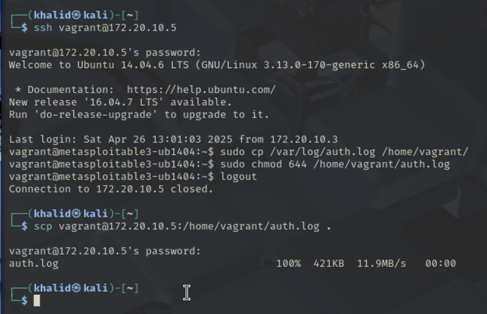
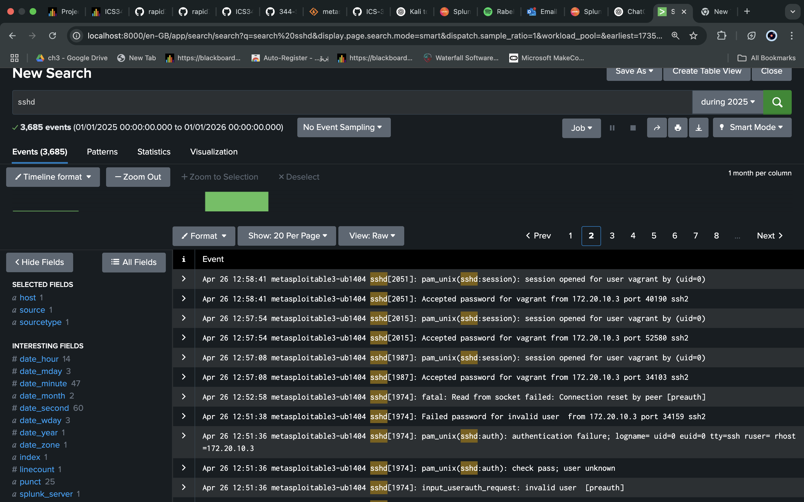
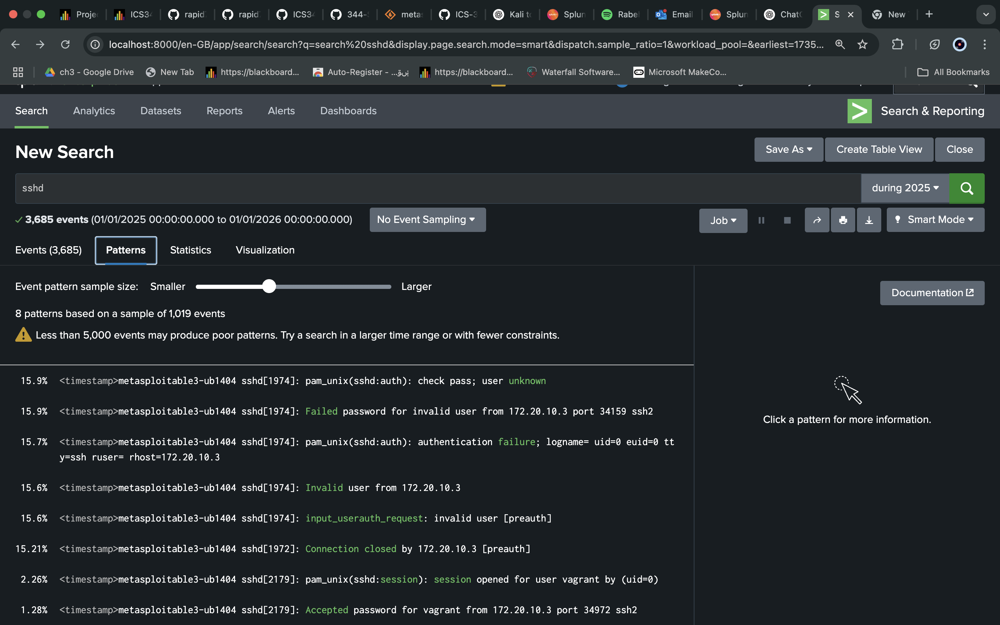
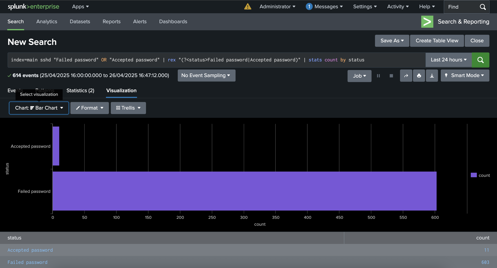
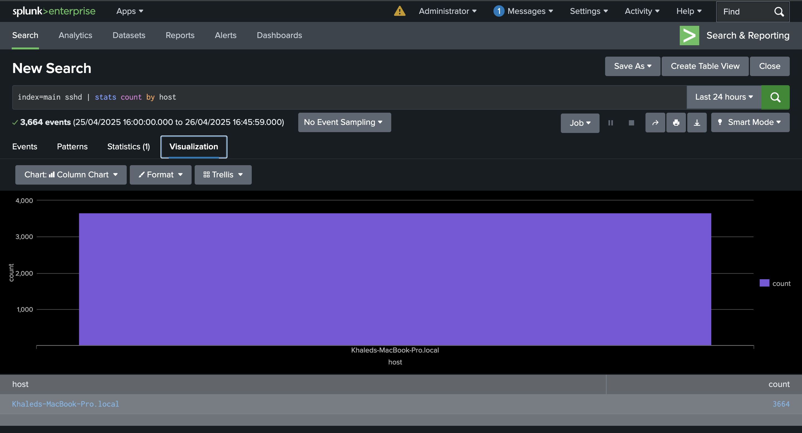

# Phase 2: Visual Analysis with a SIEM Dashboard

---

## Introduction

In this phase, a Security Information and Event Management (SIEM) system was implemented using Splunk Enterprise to collect, upload, analyze, and visualize SSH attack logs.  
The objective was to monitor activities from both the attacker (Kali Linux) and the victim (Metasploitable3) environments, and detect cyberattack patterns using log analysis and visualization.

---

## Step 1: Environment Setup

| Machine | Role | Description |
|:--------|:-----|:------------|
| Kali Linux (VMware) | Attacker | Performed SSH brute-force and scripted attacks |
| Metasploitable3 (UTM) | Victim | Hosted a vulnerable SSH service |
| MacBook Pro (Host) | SIEM/Monitoring | Installed and operated Splunk Enterprise |

- Splunk Version: **9.4.1**
- Network Mode: **Bridge Network** to allow direct connection.

---

## Step 2: Splunk Installation

- Downloaded Splunk Enterprise `.dmg` package for Mac.
- Installed Splunk using the graphical installer.
- Accepted license agreements.
- Set the Splunk administrator username and password.

---

## Step 3: Attack Simulation

SSH attacks were already performed during Phase 1 to generate log activity:

- **Task 1.1**: Using Metasploit Framework:
  - Launched an SSH login attempt exploit.
  - Targeted IP address: 172.20.10.5 (Metasploitable3).
  - Username and password: vagrant/vagrant.
  
- **Task 1.2**: Using a custom Python script:
  - Scripted SSH login automation using `paramiko` library.
  - Connected from Kali to Metasploitable3 IP address.

---

## Step 4: Extracting Log Files

1- Entering victim machine from attacker side:

```bash
ssh vagrant@172.20.10.5
```

2- Copy the file to directory that is feasible to Kali:

```bash
sudo cp /var/log/auth.log /home/vagrant/
```

3- Give the permission to read the file by anyone:

```bash
sudo chmod 644 /home/vagrant/auth.log
```

4- After logout from victim machine and back to attacker, we can copy the file to attacker using:

```bash
scp vagrant@172.20.10.5:/home/vagrant/auth.log •
```



## Step 4: Upload Logs File to Splunk

1- Run Splunk using the helper downloaded earlier
2- Access Splunk on http://localhost:8000/
3- Settings → Add Data → Files & Directories → Upload

## Step 5: Start Searching

### 1- Search for all SSHD events

```bash
sshd
```



**We can walkthrough the events and notice the moment at which brute-force found the correct credentials**

### 2- Check the Pattern of sshd attacks



### 3- Filter the events by accepted and failed logins 

```bash
index=main sshd "Failed password" OR "Accepted password" | rex "(?<status>Failed password| Accepted password)" | stats count by status
```



### 4- Filter the events by attackers host

```bash
index=main sshd stats count by host
```




