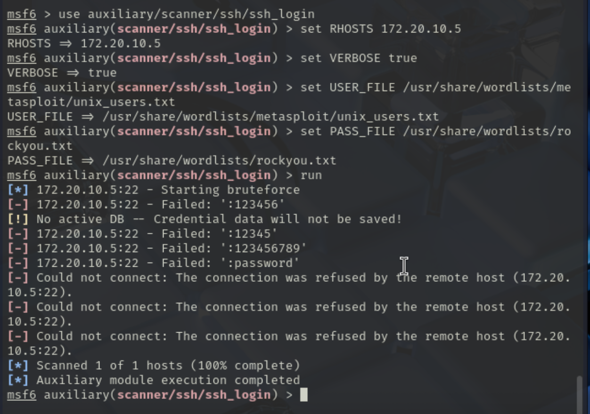
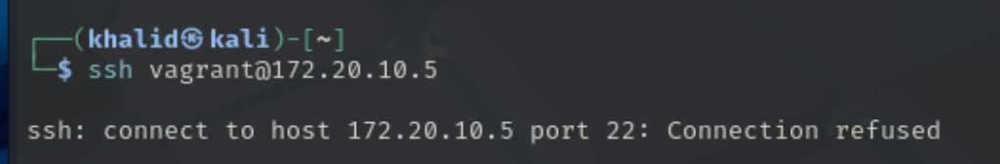
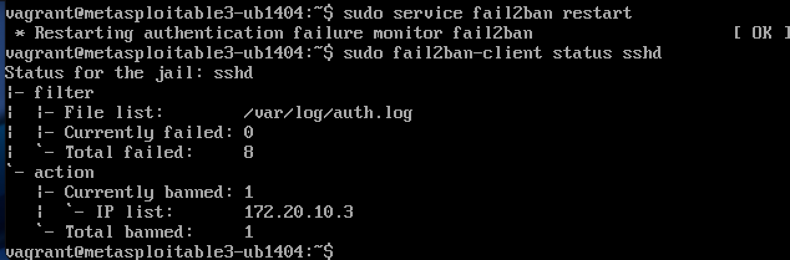

# Phase 3: Defensive Strategy Proposal

---

## Introduction

In this phase, a defensive mechanism was proposed, implemented, and tested to protect the vulnerable SSH service running on the victim machine (Metasploitable3).  
The goal was to mitigate brute-force SSH attacks and demonstrate the improved security status after defense deployment.

---

## Step 1: Environment Overview

| Machine | Role | Description |
|:--------|:-----|:------------|
| Kali Linux (VMware) | Attacker | Launched SSH brute-force attacks |
| Metasploitable3 (UTM) | Victim | Hosted SSH service |

---

## Step 2: Defense Selection

The chosen defensive strategy was to install and configure **fail2ban** on the victim machine.  
Fail2ban monitors system logs and automatically bans IP addresses after multiple failed SSH login attempts.

Reasons for selecting fail2ban:
- Easy and lightweight to configure.
- Effective against brute-force SSH attacks.
- Well-documented and widely used in production environments.

---

## Step 3: Defense Implementation

### 3.1 Install and Configure fail2ban

1- SSH into the victim machine:

```bash
ssh vagrant@172.20.10.5
```
2- Update package lists:

```bash
sudo apt-get update
```


3- install fail2ban:

```bash
sudo apt-get install fail2ban -y
```


4- Configure fail2ban for SSH Protection

```bash
sudo nano /etc/fail2ban/jail.local
```

Then write the following script into the file:
```bash
[sshd]
enabled = true
port = ssh
filter = sshd
logpath = /var/log/auth.log
maxretry = 3
bantime = 3600
findtime = 600
```
- **maxretry: 3 failed attempts allowed before banning.**

- **bantime: IP address is banned for 1 hour.**

- **findtime: Failures are counted over a 10-minute window.**

 


5- restart fail2ban service
```bash
sudo service fail2ban restart
```

6- Check  file status:
```bash
sudo fail2ban-client status sshd
```


### 3.2 Performing the Attack 

1- Brute-Force Attack Attempt:


Observation:
**We notice that after three wrong password attempts, access to the victim system is blocked as specified in the fail2ban configuration.**

2- Attempting to Access After Being Banned:


Observation:
**Since the attacker's IP address was banned, all further SSH access attempts were refused for 1 hour, ensuring the system’s protection.**

### 3.3 Checking fail2ban After Attack

Explanation:

- **The status output shows a total of 8 failed login attempts recorded.**

- **It also displays the list of banned IP addresses, confirming that the attacker's IP was automatically banned by fail2ban.**

## Conclusion
The deployment of fail2ban on the victim machine effectively mitigated the SSH brute-force attack.
By setting a maximum retry limit and banning repeated failed login attempts, the system became resilient to unauthorized access attempts.
This demonstrates the importance and effectiveness of simple, automated defensive tools in enhancing cybersecurity posture.

# End of Phase 3
