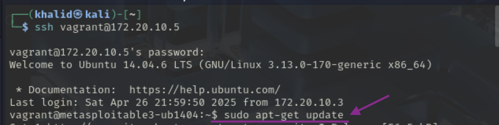
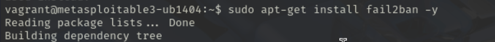
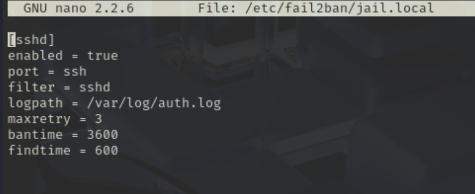
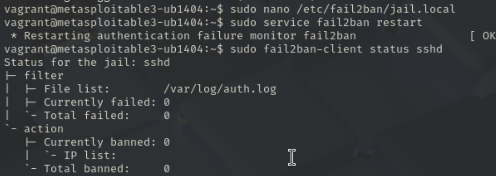

# Phase 3: Defensive Strategy Proposal

---

## Introduction

In this phase, a defensive mechanism was proposed, implemented, and tested to protect the vulnerable SSH service running on the victim machine (Metasploitable3).  
The goal was to mitigate brute-force SSH attacks and demonstrate the improved security status after defense deployment.

---

## Step 1: Environment Overview

| Machine | Role | Description |
|:--------|:-----|:------------|
| Kali Linux (VMware) | Attacker | Launched SSH brute-force attacks |
| Metasploitable3 (UTM) | Victim | Hosted SSH service |

---

## Step 2: Defense Selection

The chosen defensive strategy was to install and configure **fail2ban** on the victim machine.  
Fail2ban monitors system logs and automatically bans IP addresses after multiple failed SSH login attempts.

Reasons for selecting fail2ban:
- Easy and lightweight to configure.
- Effective against brute-force SSH attacks.
- Well-documented and widely used in production environments.

---

## Step 3: Defense Implementation

### 3.1 Install fail2ban

1- SSH into the victim machine:

```bash
ssh vagrant@172.20.10.5
```
2- Update package lists:

```bash
sudo apt-get update
```


3- install fail2ban:

```bash
sudo apt-get install fail2ban -y
```


4- Configure fail2ban for SSH Protection

```bash
sudo nano /etc/fail2ban/jail.local
```

Then write the following script into the file:
```bash
[sshd]
enabled = true
port = ssh
filter = sshd
logpath = /var/log/auth.log
maxretry = 3
bantime = 3600
findtime = 600
```
- **maxretry: 3 failed attempts allowed before banning.**

- **bantime: IP address is banned for 1 hour.**

- **findtime: Failures are counted over a 10-minute window.**

 


5- restart fail2ban service
```bash
sudo service fail2ban restart
```

6- Check  file status:
```bash
sudo fail2ban-client status sshd
```




